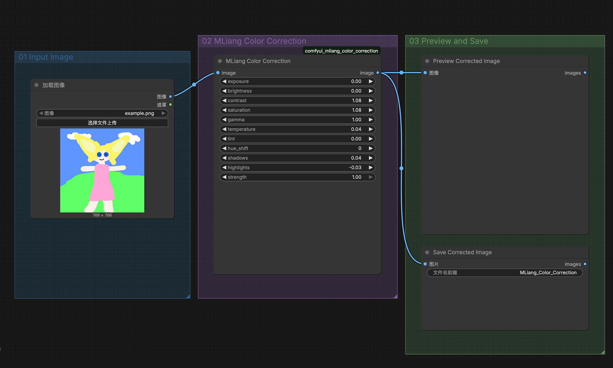

# MLiang Color Correction for ComfyUI

一个轻量、纯净的 ComfyUI 图像颜色校正节点包，用于在工作流末端快速微调曝光、对比度、饱和度、色温、色调、阴影和高光。

A lightweight ComfyUI custom node package for final image color correction, designed for quick exposure, contrast, saturation, temperature, tint, shadow, and highlight adjustments.



## Nodes

### MLiang Color Correction

Main color grading node for ComfyUI `IMAGE` tensors.

Controls:

- `exposure`
- `brightness`
- `contrast`
- `saturation`
- `gamma`
- `temperature`
- `tint`
- `hue_shift`
- `shadows`
- `highlights`
- `strength`

### MLiang White Balance

Simple RGB white balance node.

Controls:

- `red`
- `green`
- `blue`
- `normalize_luma`
- `strength`

Both nodes accept and return ComfyUI `IMAGE` tensors in `[batch, height, width, channels]` format.

## Example Workflow

A clean showcase workflow is included:

[examples/MLiang_Color_Correction_Showcase.json](examples/MLiang_Color_Correction_Showcase.json)

Workflow structure:

```text
Load Image -> MLiang Color Correction -> Preview Image / Save Image
```

This example is intentionally minimal, so it can be used as a pure demo workflow or dropped into another image generation pipeline.

## Installation

Clone this repository into your ComfyUI `custom_nodes` folder:

```bash
cd ComfyUI/custom_nodes
git clone https://github.com/dingmuliang/comfyui_mliang_color_correction.git
```

Restart ComfyUI after installation.

## Usage

1. Load an image with ComfyUI's built-in `Load Image` node.
2. Connect it to `MLiang Color Correction`.
3. Adjust the color parameters.
4. Connect the output to `Preview Image` or `Save Image`.

Recommended use cases:

- final color polish after txt2img/img2img generation
- matching generated images to a reference color mood
- quick brightness and contrast fixes before sending images back to Photoshop
- lightweight workflow demonstrations without model dependencies

## Compatibility

- ComfyUI
- PyTorch tensor operations
- No extra model files required
- No external Python dependencies beyond the standard ComfyUI environment

## Project Structure

```text
comfyui_mliang_color_correction/
├── __init__.py
├── README.md
├── LICENSE
├── assets/
│   └── MLiang_Color_Correction_Showcase.png
└── examples/
    └── MLiang_Color_Correction_Showcase.json
```

## License

MIT License

